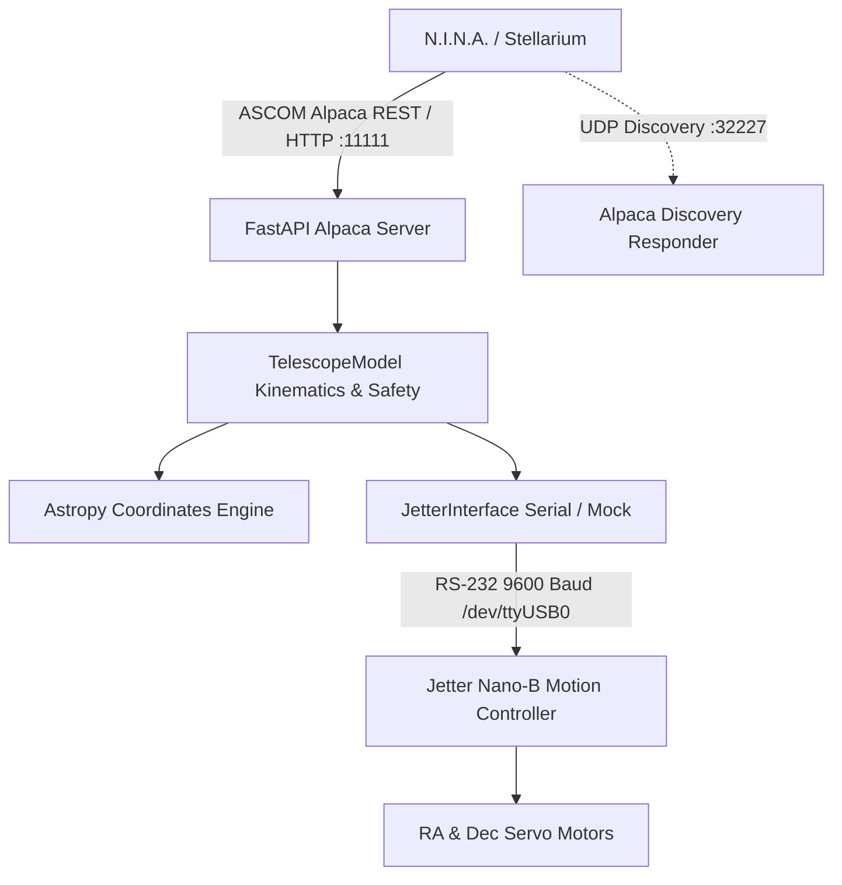

# Kaukoputki System Architecture

This document describes the modern cross-platform architecture of the Kaukoputki ASCOM Alpaca telescope control driver, replacing the legacy Windows 98 MATLAB system.

---

## 1. System Overview

The system is designed to run seamlessly on modern Linux (e.g. Raspberry Pi, Debian, Ubuntu) and Windows PCs. It interfaces between modern astronomical acquisition software (N.I.N.A., Stellarium, PHD2) and the legacy Jetter Nano-B motion controller.

---

## 2. Core Subsystems

### 2.1 Configuration Layer (`app/config.py`)
- Persistent configuration stored in `app/config.json`.
- Holds:
  - Observatory geographic parameters (Jakokoski Observatory).
  - Hardware serial parameters (Port, Baud, Timeout, Mock mode).
  - Mount kinematics (Reduction ratios $M_{RA}=18800$, $M_{DE}=14100$, counts $N_{step}=512$).
  - **User-Editable Safety Limits** ($HA \in [-220^\circ, +220^\circ]$, $\delta \in [-50^\circ, +90^\circ]$, $Alt > 0^\circ$, Solar separation $> 4^\circ$, Max Slew Speed).

### 2.2 Jetter Hardware Abstraction Layer (`app/jetter_interface.py`)
- Manages RS-232 serial communication with the Jetter Nano-B using PySerial.
- Encapsulates low-level telegram framing and XOR checksums.
- Features `MockJetterController`:
  - An in-memory, thread-safe hardware simulator of Jetter registers (`12100..12199` and `13100..13199`).
  - Simulates smooth velocity integration, position mode vs speed mode, target-reached status flags, and warning buzzer outputs.
  - Allows full automated testing and development without requiring physical hardware connected.
- Dedicated `abort_motion()` method for instant emergency shutdown.

### 2.3 Kinematics, Safety & Coordinate Engine (`app/telescope_model.py`)
- Powered by `astropy.coordinates` and `astropy.time.Time`.
- Calculates real-time Local Sidereal Time (LST), topocentric refraction, and solar coordinates.
- Manages mount states:
  - **Park Reference**: Initialized at South meridian ($HA = 0^\circ, \delta = 0^\circ$), setting initial Right Ascension $RA = LST$.
  - **Calibration State**: Mount boots with `is_calibrated = False`. Calibration is confirmed upon plate-solve sync.
  - **Software Envelopes**: Pre-checks every motion command against HA, Dec, Altitude, and Sun distance.
  - **Sidereal Tracking**: Independent background thread increments RA at the sidereal rate ($111.712\text{ steps/s}$).

### 2.4 ASCOM Alpaca Server & Discovery (`app/alpaca_server.py`, `app/alpaca_discovery.py`)
- Fully adheres to ASCOM Alpaca Telescope V3 specification.
- Exposes:
  - Management API (`/management/apiversions`, `/management/v1/description`, `/management/v1/configureddevices`).
  - Device API (`/api/v1/telescope/0/...`).
  - Custom safety and calibration endpoints (`/api/v1/telescope/0/safety`, `/api/v1/telescope/0/calibration`).
- Background UDP responder on port 32227 for automated network discovery.
