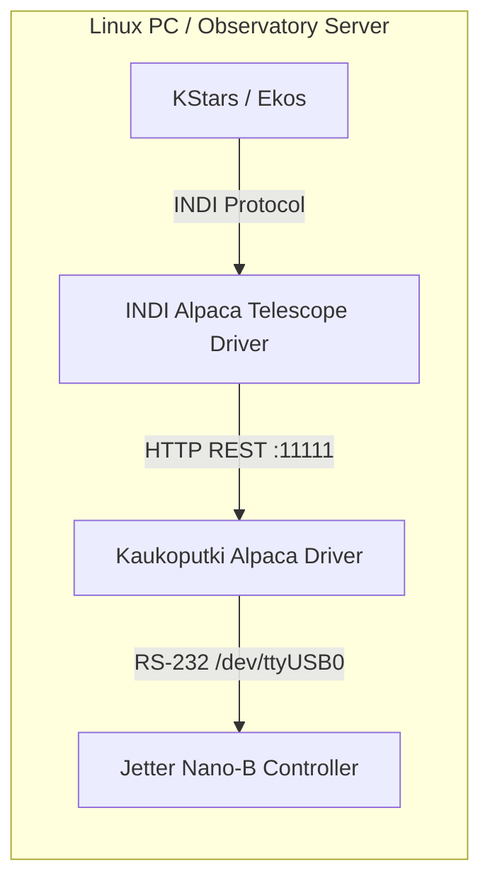

# KStars & Ekos Connection Guide for Linux

This guide explains how to connect and operate the **Kaukoputki Jetter Nano-B Telescope Driver** using **KStars and Ekos** on Linux (Ubuntu, Debian, Raspberry Pi OS, Astroberry, or StellarMate).

---

## 1. Overview & Architecture

KStars/Ekos uses the **INDI (Instrument-Neutral Device Interface)** protocol. INDI includes a native **INDI-Alpaca bridge driver** (`indi_alpaca_telescope`), allowing Ekos to seamlessly connect to our ASCOM Alpaca driver over the local network or on `localhost`.



---

## 2. Prerequisites & Installation

### Step 1: Install KStars and INDI Drivers
On Debian / Ubuntu / Mint / Raspberry Pi OS:

```bash
# Add official INDI PPA (Ubuntu/Mint)
sudo add-apt-repository -y ppa:mutlaqja/ppa
sudo apt update

# Install KStars, Ekos, and INDI standard drivers (which include Alpaca support)
sudo apt install -y kstars-bleeding indi-bin indi-alpaca astap
```

*(If on Debian or Raspberry Pi OS without PPA, install via `sudo apt install -y kstars indi-bin` or use pre-configured astronomical distributions like Astroberry or StellarMate).*

### Step 2: Ensure Kaukoputki Driver is Running
Verify the Kaukoputki driver service is running in another terminal or as a systemd service:

```bash
cd ~/kaukoputki
source .venv/bin/activate
python run_driver.py --port /dev/ttyUSB0
```
*(Or `python run_driver.py --mock` for testing without hardware).*

The Alpaca server should report listening on port `11111`.

---

## 3. Configuring Ekos Profile

1. Open **KStars**.
2. Click the **Ekos** icon on the top toolbar (or press `Ctrl + K`).
3. In the Ekos setup window:
   - Click the **+** (Add Profile) button or edit your existing profile.
   - **Profile Name**: e.g., `Jakokoski Observatory`.
   - **Mode**: Select **Local** (if KStars and the driver run on the same machine) or **Remote** (if connecting across LAN).
   - Under **Mount**: Select **Alpaca Mount** (or **Alpaca Telescope**).
   - Under **CCD / Camera**: Select your primary imaging camera (e.g. ZWO, QHY, DSLR, or CCD Simulator).
   - Under **Guider**: Select your guide camera or **Internal Guider**.
   - Click **Save**.

---

## 4. Connecting to the Alpaca Driver

1. In Ekos, select the newly created profile and click **Start INDI**.
2. The **INDI Control Panel** window will open.
3. Select the **Alpaca Mount** tab:
   - Go to the **Connection** or **Alpaca Server** tab:
     - **Server Host / IP**: `127.0.0.1` (or the IP address of the Linux server if remote).
     - **Alpaca Port**: `11111` (default Kaukoputki port).
     - **Device Number**: `0`.
   - Click **Save** to persist these settings in INDI.
4. Click **Connect**:
   - The status light in INDI turns green.
   - Ekos will query mount coordinates and tracking status from the Kaukoputki driver.
   - The mount icon will appear in KStars sky map pointing at the South Park coordinates ($HA = 0^\circ, \delta = 0^\circ$).

---

## 5. Plate-Solve Alignment & Calibration Workflow

> [!IMPORTANT]
> **Calibrating the Mount via Ekos**:
> Because physical homing switches have been removed, the mount starts in an uncalibrated state. Use the Ekos **Align** module after your first slew to calibrate pointing.

1. **Unpark the Mount**:
   - In the Ekos **Mount** tab, click **Unpark**.
   - Tracking is automatically engaged.
2. **Slew to a Target Star / Field**:
   - In KStars, right-click a bright star (e.g. Vega, Deneb, Altair, or Polaris) or deep sky object near the meridian.
   - Select **Telescope** $\to$ **Slew**.
   - The Kaukoputki driver will verify safety envelopes, turn on the warning buzzer, and slew the mount.
3. **Capture & Solve (Plate Solving)**:
   - In Ekos, switch to the **Align** module (target icon).
   - Set **Action** to **Sync** (or **Slew to Target**).
   - Solver: Select **StellarSolver** (internal) or **ASTAP**.
   - Exposure: 2–5 seconds with binning $2\times2$.
   - Click **Capture & Solve**.
4. **Automatic Synchronization**:
   - Once resolved, Ekos automatically issues an INDI `Sync` command to the mount.
   - The Kaukoputki driver receives `/api/v1/telescope/0/synctocoordinates`, updates internal offsets, and marks:
     `is_calibrated = True`!
   - Subsequent slews across the sky will now be aligned.

---

## 6. Auto-Guiding in Ekos

Ekos includes a built-in guiding module that uses pulse-guiding commands sent through the mount driver:

1. In Ekos, switch to the **Guide** module.
2. Set **Guide Via**: Select **Mount** (Pulse Guiding via Alpaca driver).
3. Set **Calibration**:
   - Choose Calibration Step (e.g. 500 ms).
   - Point to a star near the celestial equator ($Dec \approx 0^\circ$).
   - Click **Calibrate**.
4. Click **Guide**:
   - Ekos calculates centroid drift and sends pulse correction commands (`moveaxis` / `pulseguide`) to the Kaukoputki driver.

---

## 7. Troubleshooting

| Issue | Likely Cause | Solution |
| :--- | :--- | :--- |
| **INDI Alpaca Mount driver fails to connect** | Driver service is not running or port is blocked | Verify `python run_driver.py` is running and port `11111` is accessible (`curl http://127.0.0.1:11111/management/apiversions`). |
| **Slew rejected in Ekos** | Safety limit violated | Check driver logs. The target may be below horizon ($Alt < 0^\circ$), beyond $HA \pm 220^\circ$, or within $4^\circ$ of the Sun. |
| **Mount does not move when slewing** | Mount is parked | Click **Unpark** in Ekos Mount tab before slewing. |
| **"Serial port permission denied" on driver startup** | Linux user lacks dialout permissions | Run `sudo usermod -aG dialout $USER` and relog. |
